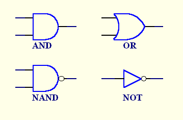

# chapter 1: boolean logic
The Boolean pipeline:

  * gates
  * functions
  * values
  * binary

## boolean functions/operators
The basic logic operators:

notation | operator
--- | ---
a $\cdot$ b | AND
a $+$ b | OR
$\overline{a}$ | AND

A *truth table* enumerates all *inputs* and *outputs* of a boolean function. For instance:

x | y | z | f(x, y, z)
--- | --- | --- | ---
0 | 0 | 0 | 0
0 | 0 | 1 | 0
0 | 1 | 0 | 1
0 | 1 | 1 | 0
1 | 0 | 0 | 1
1 | 0 | 1 | 0
1 | 1 | 0 | 1
1 | 1 | 1 | 0

Every boolean function can be formulated by at least one boolean expression -- its *canonical representation*. To
derive it, take all rows with an output of 1:

x | y | z | f(x, y, z)
--- | --- | --- | ---
0 | 1 | 0 | 1
1 | 0 | 0 | 1
1 | 1 | 0 | 1

Take the *input* values, and:

  1. `not` the 0 values in each row
  2. `and` the values in each row together
  3. `or` rows together

So:

$$
f(x, y, z) = \overline{x}y\overline{z} + x\overline{yz} + xy\overline{z}
$$

## logic gates

All boolean functions can thus be represented in terms of `AND`/`OR`/`NOT`. `AND`/`OR`/`NOT` can themselves be
constructed out of only the `NAND` operation. $\therefore$ All boolean functions can be represented in terms of
`NAND`.

The number of boolean functions that can be defined over $n$ binary variables is $2^{2^n}$.

A *gate* (or chip) is a physical implementation of a boolean function. A gate with $n$ arguments and $m$ return
values has $n$ *input* pins and $m$ *output* pins. Gates are constructed out of *transistors*.



A *primitive* gate is a black box that implements fundamental logical operators; examples include `AND`/`OR`/`NOT`.
Because they have input/output values of the same types (binary values, `0` or `1`), they can be chained into
*composite* gates. For instance, a three-way `AND` can be defined using the fundamental, 2-way `AND`:

$$
AND(a, b, c) = a \cdot b \cdot c = (a \cdot b) \cdot c = AND(AND(a, b), c)
$$

`XOR` can be defined:

$$
XOR(a, b) = (a \cdot \overline{b}) + (\overline{a} \cdot b) = OR(AND(a, NOT(B)), AND(NOT(a), b))
$$

*Logic design* is the art of creating composite gates.

Gate *implementation* vs. *interface*:

Chips are designed using a *<b>H</b>ardware <b>D</b>escription <b>L</b>anguage*, or an **HDL**; alternatively, a
**VHDL**, or *<b>V</b>irtual HDL*. Any HDL definition contains two sections:

  1. header: a description of the API, arguments, return value, etc.
  2. parts: a description of the layout of the chip's components

HDL connects the internal components of a chip using *internal pins*. To pipe the output of a `NOT` gate into an `AND`
gate, for instance:

```c
NOT(/* ... */, out=nota)
AND(a=nota, /* ... */)
```
