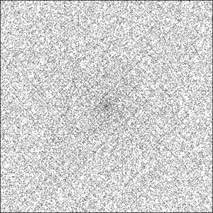
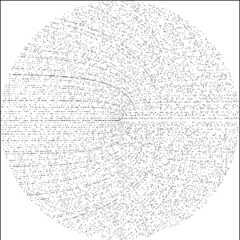

# prime number spirals

Scripts to generate the [Ulam](http://en.wikipedia.org/wiki/Ulam_spiral) and
[Sacks](http://en.wikipedia.org/wiki/Ulam_spiral#Variants) prime number spirals.




Open `index.html` in a browser, which will include javascript files that introduce the functions `ulamSpiral()` and
`sacksSpiral()` to the global namespace. Each accepts an argument `numLayers`, which indicates the number of layers in
the spiral, or half the height/width of the page's canvas. In the console:

```javascript
> ulamSpiral(300); // an Ulam Spiral with 300 layers
> sacksSpiral(300); // a Sacks Spiral with 300 layers
```
